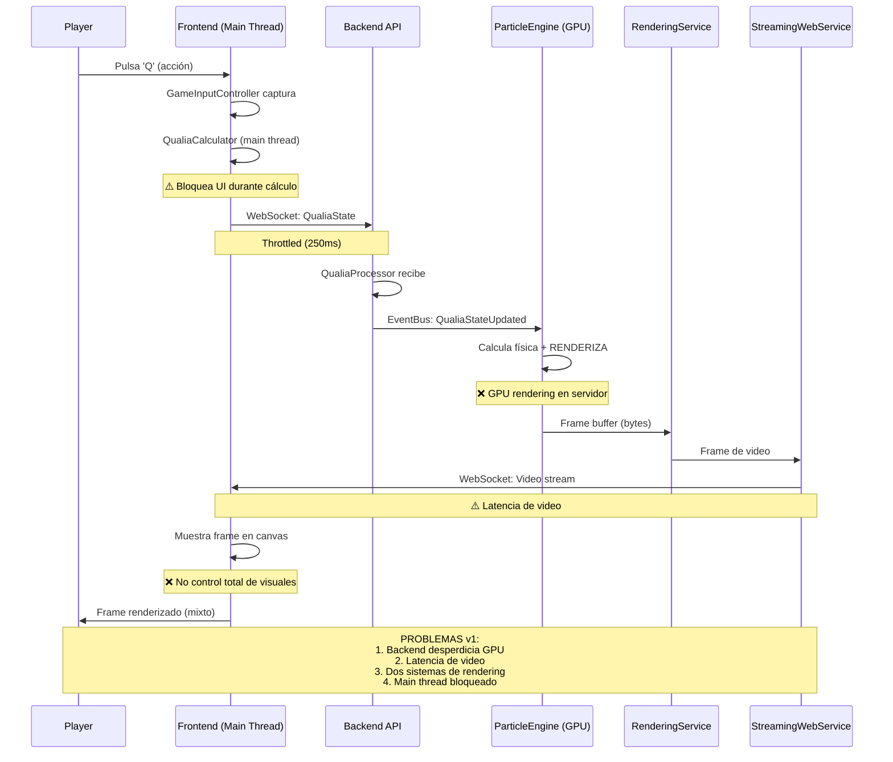
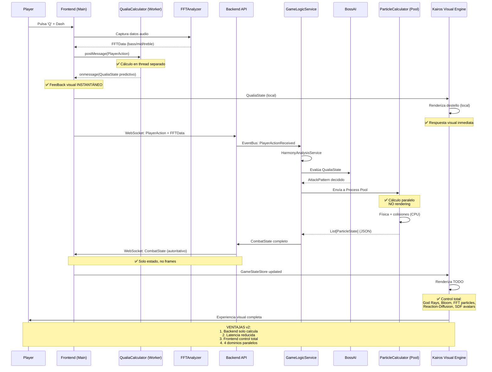
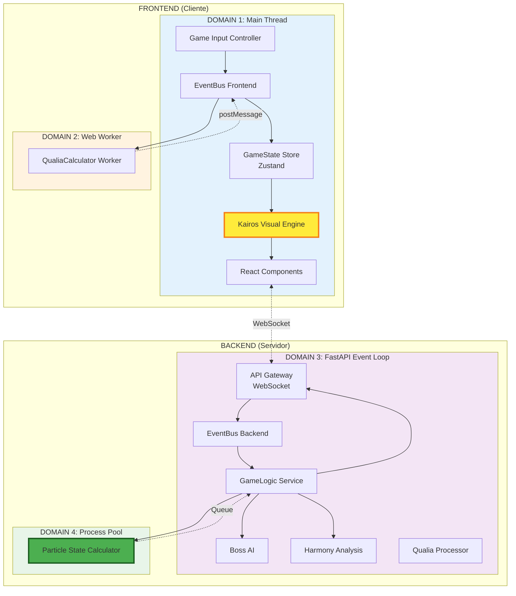
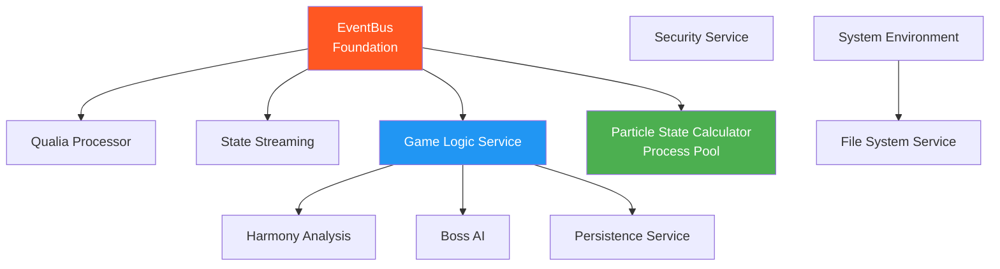
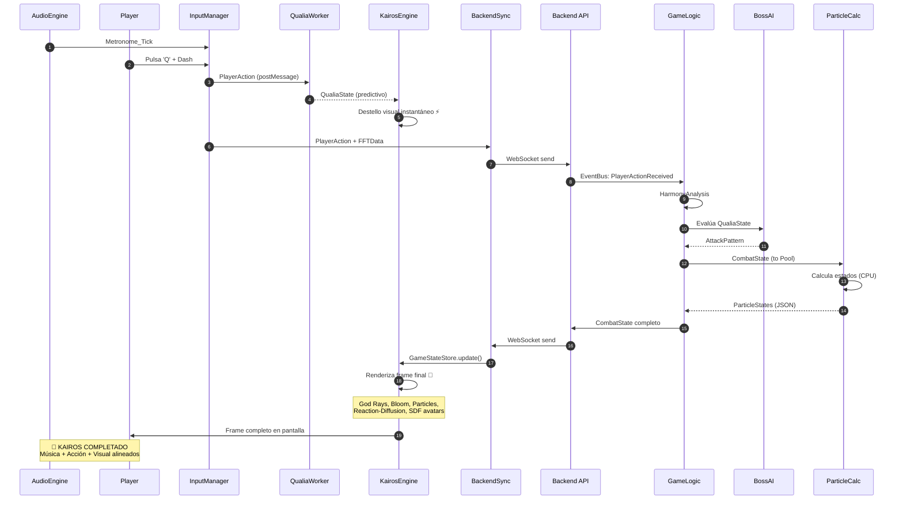
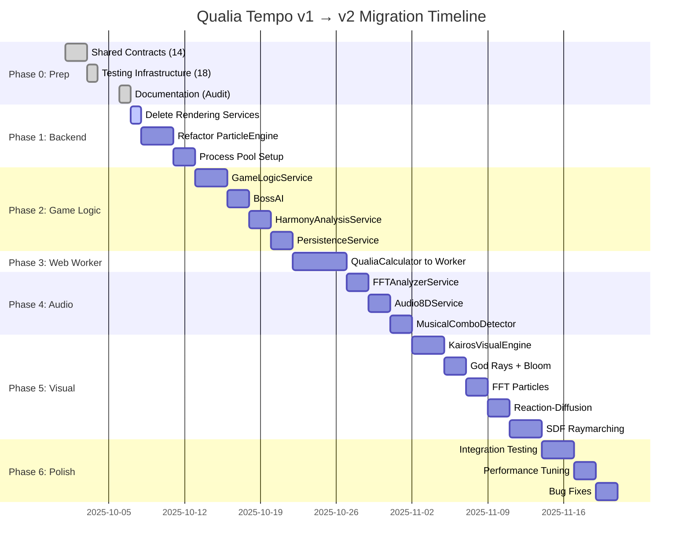
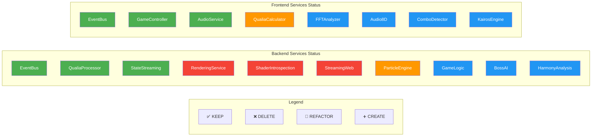

# ARCHITECTURE FLOW DIAGRAMS: v1 vs v2
# Visual Representation of Data Flow and Service Interactions
# VERSIÓN: 1.0
# FECHA: 6 de octubre de 2025

---

## 🎯 PROPÓSITO

Este documento contiene diagramas visuales en formato Mermaid que ilustran:
1. Flujo de datos v1 (actual - deprecated)
2. Flujo de datos v2 (ARCHITECTURE.GOLD.CODE)
3. Interacciones de servicios
4. Arquitectura de 4 dominios

---

## 📊 DIAGRAMA 1: Flujo de Datos v1 (DEPRECATED)



---

## 📊 DIAGRAMA 2: Flujo de Datos v2 (ARCHITECTURE.GOLD.CODE)



---

## 📊 DIAGRAMA 3: Arquitectura de 4 Dominios v2



---

## �� DIAGRAMA 4: Dependencias de Servicios Backend v2



---

## 📊 DIAGRAMA 5: Dependencias de Servicios Frontend v2

```mermaid
graph TD
    EventBus[EventBus<br/>Foundation]
    ConfigService[Configuration Service]
    Logger[Logger<br/>QualiaLogger]
    
    subgraph Core["Core Services"]
        GameInput[Game Input Controller]
        QualiaCalc[Qualia Calculator<br/>+Worker]
        GameStateStore[GameState Store Service]
        GameController[Game Controller]
        BackendSync[Backend Sync Service]
    end
    
    subgraph Audio["Audio Services (Phase 4)"]
        AudioService[Audio Service]
        FFT[FFT Analyzer]
        Audio8D[Audio 8D Service]
        ComboDetector[Musical Combo Detector]
        WebAudio[Web Audio API]
    end
    
    subgraph Visual["Visual Services (Phase 5)"]
        Kairos[Kairos Visual Engine]
        PostProc[Post Processing]
        ShaderLoader[Shader Loader]
        ViewLogic[View Logic]
        FrontendRender[Frontend Rendering]
    end
    
    subgraph Utils["Utilities"]
        Timer[Timer Service]
        Http[Http Service]
        Perf[Performance Service]
        Error[Error Reporting]
        Notif[Notification Service]
        Debug[Debug Service]
    end
    
    EventBus --> GameInput
    EventBus --> QualiaCalc
    EventBus --> GameStateStore
    EventBus --> GameController
    EventBus --> BackendSync
    EventBus --> ComboDetector
    EventBus --> Kairos
    
    ConfigService --> Http
    
    FFT --> WebAudio
    Audio8D --> WebAudio
    
    Kairos --> PostProc
    Kairos --> ShaderLoader
    Kairos --> ViewLogic
    Kairos --> FrontendRender
    
    Logger -.injected everywhere.-> Core
    Logger -.injected everywhere.-> Audio
    Logger -.injected everywhere.-> Visual
    
    style EventBus fill:#ff5722,color:#fff
    style Kairos fill:#ffeb3b,stroke:#f57f17,stroke-width:3px
    style Logger fill:#9c27b0,color:#fff
    style ConfigService fill:#00bcd4,color:#fff
```



---

## 📊 DIAGRAMA 6: Lifecycle de un "Latido" del Juego (Kairos)



---

## 📊 DIAGRAMA 7: Migration Phases Overview



---

## 📊 DIAGRAMA 8: Service States by Phase



---

## 📚 CÓMO USAR ESTOS DIAGRAMAS

### En GitHub/GitLab
Los diagramas Mermaid se renderizan automáticamente en Markdown viewers.

### En VS Code
Instalar extensión: **Markdown Preview Mermaid Support**

### En Obsidian
Funciona nativamente con bloques ```mermaid```.

### Exportar a Imagen
Usar herramientas online:
- https://mermaid.live/
- https://mermaid.ink/

---

## 📝 METADATA

- **Autor:** AI Agent (Qualia.CODE v1.1)
- **Fecha:** 6 de octubre de 2025
- **Versión:** 1.0
- **Formato:** Mermaid.js diagrams
- **Propósito:** Visualización de arquitectura v1 vs v2

---

**FIN DEL DOCUMENTO**
